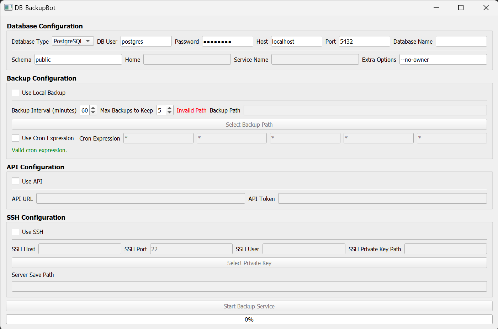

# DB-BackupBot

[](https://github.com/NullPointerExcy/DB-BackupBot/releases/latest)

A Python tool for automated database backups with optional cloud API integration and also supports remote backups via SSH.
> Don't forget to add environment variables if needed.
## Usage

### Running the application
#### Using the Executable
Build the `.exe` file and execute it directly to launch the service with a GUI for configuration.
> `.exe` is currently not available (And probably will not work), because the application is still in development. And using different
> paths for the database and backup files can cause problems.
> 
> But you can start the gui from the command line (--dark_mode is optional):
```bash
cd {root}/src/ui
python config_ui.py --dark_mode
```

<p align="center">
    
</p>

#### Running from Console
You can also start the service with specific configurations or in console mode:
```bash
python main.py --start [options]
```

## Command-Line Arguments
>All arguments are saved in a configuration file for subsequent runs. So you can run the service without arguments after the first run.

| Argument                   | Type    | Default                   | Description                                                                                      |
|----------------------------|---------|---------------------------|--------------------------------------------------------------------------------------------------|
| `--start`                  | Flag    | `False`                   | Starts the backup service in console mode.                                                       |
| `--stop`                   | Flag    | `False`                   | Stops the background backup service if it is running.                                            |
| `--background`             | Flag    | `False`                   | Starts the backup service in the background (detached from console).                             |
| `--api_url`                | String  | None                      | The API URL to which backups will be sent if enabled.                                            |
| `--api_key`                | String  | None                      | API key for authentication when sending backups to the API.                                      |
| `--interval_minutes`       | Integer | 60                        | Interval in minutes for scheduling backups.                                                      |
| `--db_host`                | String  | `localhost`               | Host of the database server.                                                                     |
| `--db_port`                | Integer | 5432                      | Port number for the database connection.                                                         |
| `--db_name`                | String  | Required                  | Name of the database to back up.                                                                 |
| `--db_user`                | String  | Required                  | Username for the database authentication.                                                        |
| `--db_password`            | String  | Required                  | Password for the database user.                                                                  |
| `--db_type`                | String  | `PostgreSQL`              | Type of database to back up (`PostgreSQL`, `MySQL`, `SQLite`, `MSSQL`, `Oracle`).                |
| `--use_local_backup`       | Flag    | `True`                    | Store the database backup locally.                                                               |
| `--backup_path`            | String  | Required                  | Path where the backup files will be stored.                                                      |
| `--max_backup_files`       | Integer | 5                         | Maximum number of backup files to keep (older backups are deleted once the limit is exceeded).   |
| `--schema`                 | String  | `public`                  | The database schema to back up (required for PostgreSQL and Oracle).                             |
| `--home`                   | String  | None                      | Path to the database installation (required for some setups, e.g., Oracle or custom PostgreSQL). |
| `--service_name`           | String  | None                      | Service name or SID for Oracle and MSSQL connections.                                            |
| `--extra_options`          | String  | `--no-owner`              | Additional command-line options for database dump commands.                                      |
| `--ssh_host`               | String  | None                      | Host of the SSH server for remote backups.                                                       |
| `--ssh_port`               | Integer | 22                        | Port number for the SSH connection.                                                              |
| `--ssh_user`               | String  | None                      | Username for the SSH authentication.                                                             |
| `--ssh_private_key`        | String  | None                      | Path to the private key file for SSH authentication.                                             |
| `--ssh_server_folder_path` | String  | Root folder of the server | Path to the folder on the remote server where backups will be stored.                            |


## Example
### Starting the Backup Service in the Console
```bash
python main.py --start --db_name my_database --db_user my_user --db_password my_password --api_url https://my-api.com --api_key my_api_key
```

### Starting the Backup Service in the Background
```bash
python main.py --start --background
```

### Stopping the Backup Service
```bash
python main.py --stop
```

### Sending Backups to an API
```bash
python main.py --start --api_url "https://backup-api.example.com" --api_key "your_api_key_here"
```

### Sending Backups to a Remote Server via SSH
```bash
python main.py --start --ssh_host "backup.example.com" --ssh_user "example-user" --ssh_private_key "path/to/private_key"
```

## Notes
- Use `--background` to keep the service running independently of the terminal session.
- The service reads from JSON configuration files by default. Command-line arguments can override these settings and are saved for subsequent runs.
